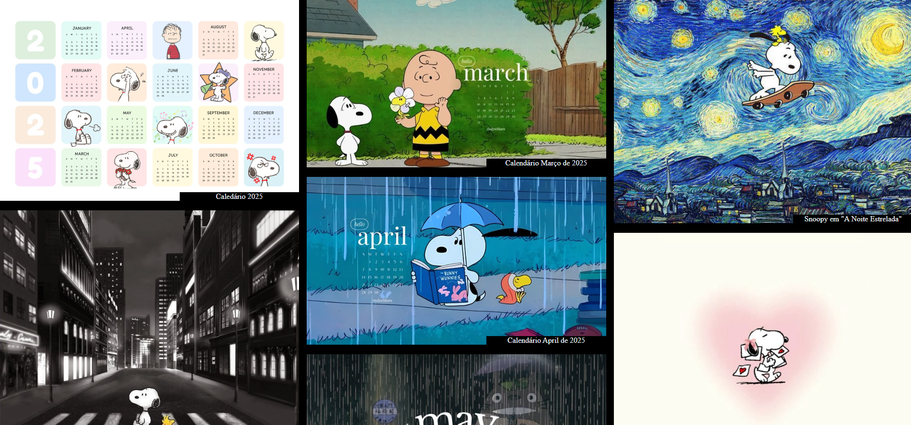

# Galeria JavaScript

## Projeto Galeria de Imagens - Disciplina de Programação Front-End

Este projeto consiste em uma atividade prática da disciplina de Programação Front-End, parte do curso Técnico em Desenvolvimento de Sistemas do SENAI. O principal objetivo da atividade é aplicar os conhecimentos adquiridos em aula relacionados a HTML, CSS e JavaScript, através da criação de uma galeria de imagens.

## Tecnologias utilizadas

* HTML
* CSS
* JavaScript

## Autor

[Milla Regina](https://www.linkedin.com/in/milla-regina-468020206)